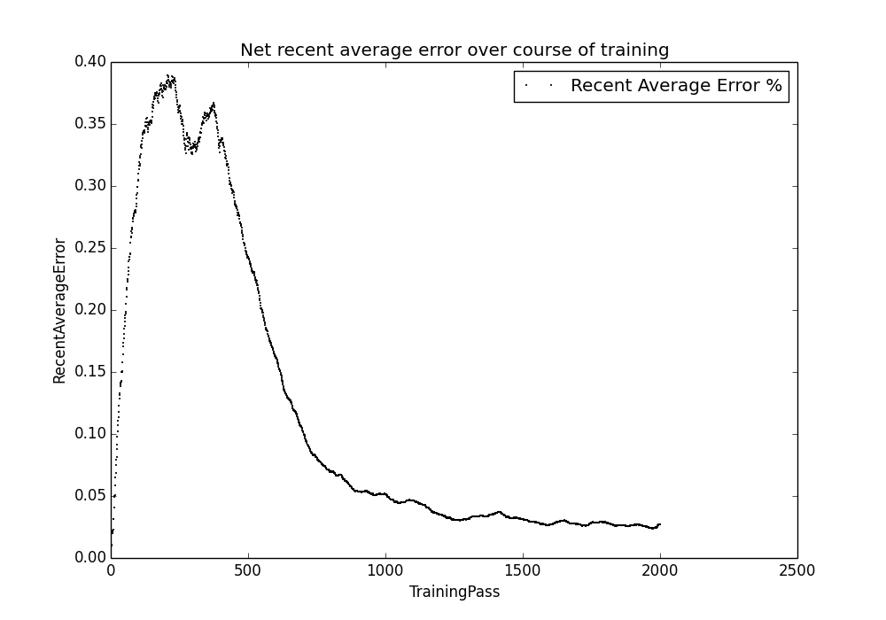

Simple Neural Net Project
=========================

Overview
--------

This is a simple artificial neural network designed to improve performance on
training an XOR function from scratch. The source code is modified from the
["Neural Net in C++ Tutorial" by David Miller](https://vimeo.com/19569529).

Assumptions: the neural network is fully connected, implicitly connected,
forward connected. Each neuron is fully connected to each neuron to the
"right" (each neuron closer to the output).

Features: back propagation as the method, gradient descent as the algorithm,
and adjustable momentum.

XOR Function
------------

This mini neural net trains an XOR (Exclusive OR) function.

This is like a "Hello World" function for testing the neural net performance.

Expected input to output values:

|In 0|In 1|Out|
|----|----|---|
|0   |0   |0  |
|0   |1   |1  |
|1   |0   |1  |
|1   |1   |0  |

Error Rate Graph
----------------

Run the `graphit.py` script to show a graph of the error rate for a given
number of training samples.

Latest: 

As we can see, the error rate should drop below 5% in under 2000 passes over
the training data.
